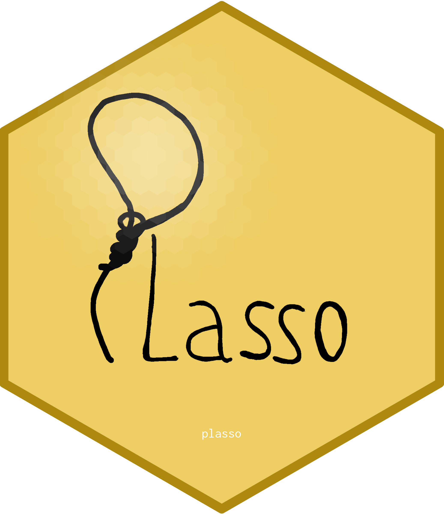

# plasso 

Built on top of the `glmnet` library by @glmnet, the `plasso` package follows @knaus and comes up with two functions that estimate least squares Lasso and Post-Lasso models.
The `plasso()` function adds coefficient paths for a Post-Lasso model to the standard `glmnet()` output.
On top of that `cv.plasso()` cross-validates the coefficient paths for both the Lasso and Post-Lasso model and provides optimal hyperparameter values for the penalty term lambda.

### Bug reports & support

For reporting a bug, simply [open an issue](https://github.com/stefan-1997/plasso/issues/new) on GitHub. For personal contact, you can write an email to michael.knaus\@uni-tuebingen.de.
  
### References

